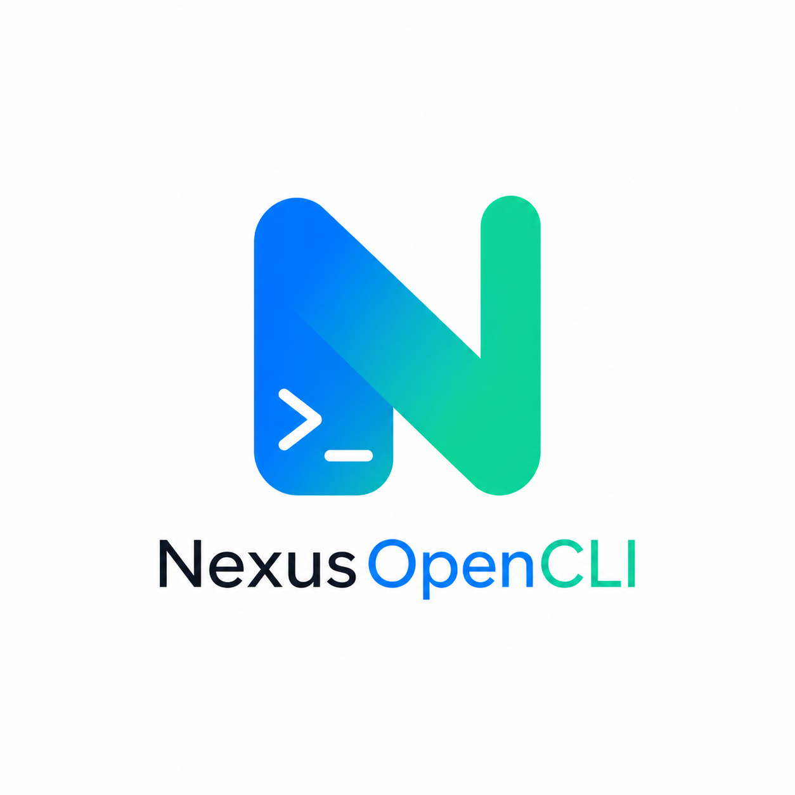

# NexusOpenCLI



[English](../README.md) | [中文](README.zh-CN.md)

NexusOpenCLI 是一个可扩展的 Typer 命令行工具，启动时会自动加载内置与第三方插件，让你通过安装插件包来添加新命令。

## 开发原因

在日常开发与效率工具使用过程中，我发现一个长期存在的问题：

> CLI 工具非常多，但彼此割裂、难以统一管理。

比如：

- 不同工具需要单独安装、记忆命令
- 功能分散，缺乏统一入口
- 想扩展功能时，往往需要自己重新开发一个 CLI

因此，我希望构建一个：

> **像App Store 一样的 CLI 项目**

核心目标是：

- 让 CLI 工具 **像插件一样被安装**
- 让命令 **在运行时自动发现**

最终形成：

> 一个“可扩展”的 CLI 生态基础设施

## 特性

- 基于插件的命令体系，运行时发现
- 内置插件管理与批量重命名命令
- 可配置的插件来源（entry point 与可选的目录加载）
- 支持全局与单插件语言设置

## 快速开始

建议在指定目录的虚拟环境中使用`pip install nexus-open-cli`安装，并输入`ncli plugin list`查看目前命令组

[quick start](https://github.com/user-attachments/assets/20eb3058-9bee-45c1-8ae7-7a70ea16bd15)

```bash
ncli --help
ncli plugin list
```

## 安装插件

推荐选择`ncli repo`下载插件，因为插件经过`NexusOpenCLI`维护者的审核，并能像App Store一样寻找想要的插件。以`ncli repo`为例：

[ncli repo](https://github.com/user-attachments/assets/f49316a2-8fb5-4f7a-9c59-9bc99bf614a3)

或者可以选择`pip install nexus-open-cli-doctor`为例，体验插件

[show2](https://github.com/user-attachments/assets/be3a310e-2dc2-4a73-892f-a6c30dbef677)

后续添加插件可通过`ncli repo`安装插件(推荐)，也可通过 pip 安装本地文件夹或 PyPI 包：

```bash
# 使用ncli repo 安装插件
ncli repo install pluginName

# 安装本地插件目录
pip install /path/to/your-plugin

# 安装发布到 PyPI 的插件
pip install your-plugin-package
```

插件需要注册到 `nexuscli.command` entry point 组，NexusCLI 才能在启动时发现它们。安装插件后再次输入`ncli`可验证插件是否成功安装

## 配置

查看或更新插件设置：

```bash
ncli plugin config
ncli plugin config-path
```

通过交互式提示或 `--set-plugin-dir`、`--add-plugin-dir`、`--remove-plugin-dir` 选项管理插件目录。

注：

`ncli plugin config --folder-loader` 启用目录加载无效，该命令即将被弃用，不用管。

## 开发插件

你可以借助本仓库提供的`skill/ncli-plugi-dev-helper/SKILL.md`技能零基础快速开发第三方插件

## 开发

```bash
pip install -e ".[dev]"
pytest
```

## 安装在虚拟环境的情况下，让电脑任何地方都能输入 ncli 运行程序

### Windows

### 操作步骤

1. 右键 **此电脑** → 属性 → 高级系统设置 → 环境变量

2. 在**系统变量**列表里找到 `Path`，双击打开

3. 点击 **新建**，把 `ncli.exe` 所在文件夹路径填进去：

   ```bash
   #示例
   D:\nexusOpenCLI\.venv\Scripts\ncli.exe
   ```

## 许可证

MIT
